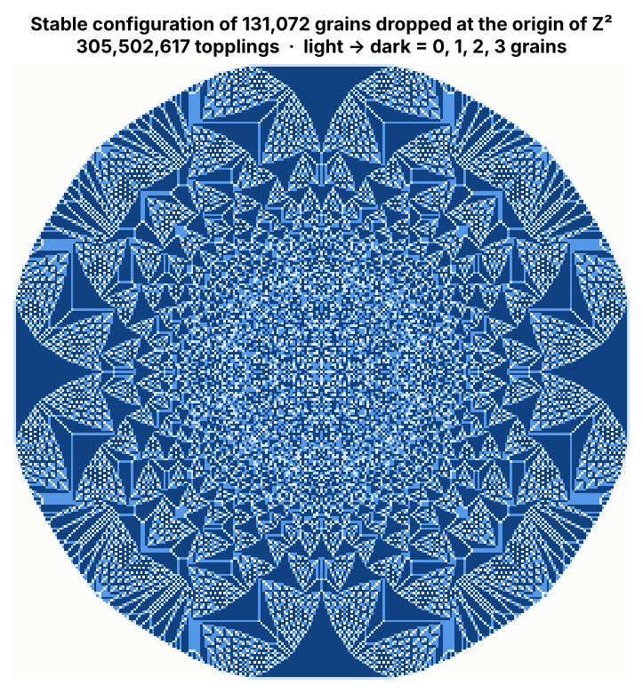
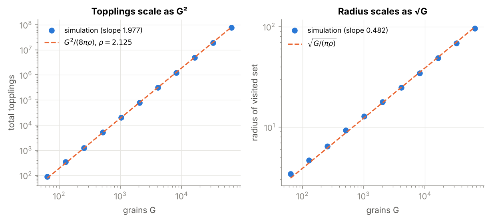
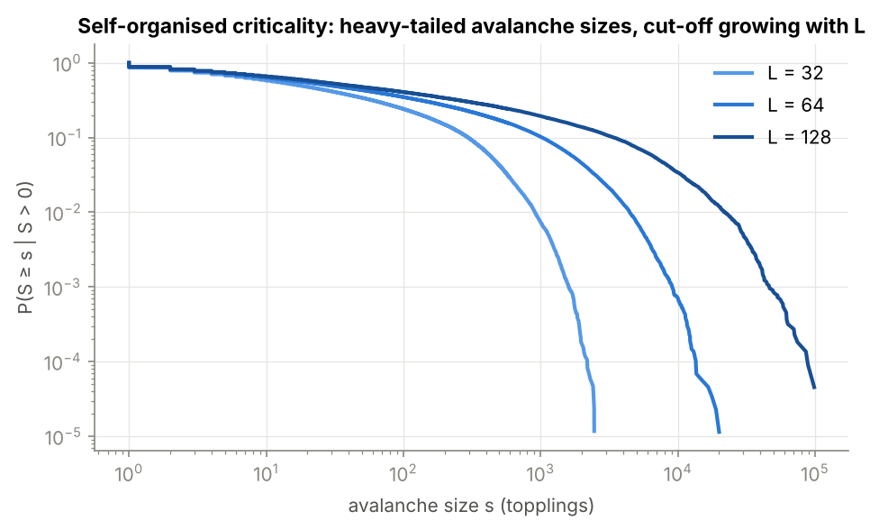

# Abelian sandpile on $\mathbb{Z}^2$: theorems, verified numerically

[](https://github.com/selimaklibi/abelian-sandpile/actions/workflows/tests.yml)
 

Research project on the Bak–Tang–Wiesenfeld sandpile, started at the *Maths C pour L* research internship (Lille):
we proved the abelian property and geometric bounds on the avalanche region (report in French:
[`report_sandpile_FR.pdf`](report_sandpile_FR.pdf)). This repository adds a vectorised simulator that
checks every statement of the report numerically, and extends it to scaling laws and self-organised criticality.

<p align="center"></p>

## Model

A configuration is $\eta:\mathbb{Z}^2\to\mathbb{N}$. A site with $\eta(x)\ge 4$ is unstable and **topples**:
$\eta \leftarrow \eta + \Delta\mathbf{1}_x$, i.e. it loses 4 grains and each of its 4 neighbours gains one.
The **odometer** $u(x)$ counts how many times $x$ toppled, so that $\eta_{\text{final}} = \eta_0 + \Delta u$.

## What is proved in the report, and how the code checks it

| Statement | Test (`tests/test_core.py`) |
|---|---|
| Abelian theorem: the final state does not depend on the toppling order | random-order and FIFO sequential toppling vs. vectorised parallel toppling: identical final state **and identical odometer** |
| The number of topplings $\ell$ is order-independent | $\ell$ equal for all schedules |
| Stabilisation is finite, mass is conserved | $\max\eta_{\text{final}}\le 3$, $\sum\eta_{\text{final}} = G$ |
| $C_n$ (sites that received a grain) is connected, $C_n\subset[-G,G]^2$ | BFS connectivity, bounding box |
| $\mathrm{Card}(\partial C_n) \le G$, $\mathrm{Card}(C_n)\le 4n+1$, $\mathrm{Card}(C_n)\le G$ | direct counts up to $G = 10^4$ |
| Boundary sites of $C_n$ keep at least one grain | checked site by site |

Two extra exact identities are used as regression tests:

* **Discrete Green identity.** Since $\Delta \Vert x\Vert^2 = 4$ on $\mathbb{Z}^2$, summation by parts gives, for a point source,
  $$\sum_x u(x) = \tfrac14 \sum_x \Vert x\Vert^2 \eta_{\text{final}}(x),$$
  which holds exactly (integer equality) in the simulations.
* **Dhar's theorem.** On an $L\times L$ grid with a sink, the mean avalanche size in the stationary regime equals
  $\frac{1}{L^2}\mathbf 1^\top(-\Delta_{\text{Dir}})^{-1}\mathbf 1$. Simulation vs. exact sparse solve:

| L | mean avalanche size (simulation) | exact (Dhar) |
|---|---|---|
| 32 | 40.49 | 40.58 |
| 64 | 153.15 | 153.04 |
| 128 | 591.94 | 593.89 |

## Extensions

**Scaling of the point source.** With $G$ grains at the origin, the identity above and a final density
$\rho\approx 2.125$ on a disc give $\sum_x u(x)\approx G^2/(8\pi\rho)$ and radius $\approx\sqrt{G/(\pi\rho)}$.
Log-log regressions over $G = 2^6,\dots,2^{16}$ give slopes **1.977** and **0.482** (log corrections explain the gap to 2 and 1/2).

<p align="center"></p>

**Self-organised criticality.** Dropping grains at random on a grid with a sink drives the pile to a critical state with
heavy-tailed avalanche sizes. Discrete power-law MLE (Clauset, Shalizi & Newman, 2009) on $s\in[10, L^2/4]$ gives
$\hat\tau = 1.63, 1.45, 1.36$ for $L = 32, 64, 128$: the estimate drifts with $L$, consistent with the known strong
finite-size corrections of the BTW model (asymptotic values around 1.2–1.3 are reported in the literature).
Single-$L$ exponent fits should therefore not be over-interpreted.

<p align="center"></p>

## Implementation notes

* `stabilize` topples every unstable site $\lfloor \eta/4\rfloor$ times per sweep with NumPy slicing; the abelian property
  makes this legal. On $\mathbb{Z}^2$ the window is doubled until no grain reaches its border, so results are exact for the
  infinite lattice (131 072 grains, 3·10⁸ topplings in about a minute).
* `drive` uses an explicit stack on Python lists, which is faster than vectorised sweeps for the many small avalanches.
* Convention: unstable iff $\eta\ge 4$, stable configurations take values in $\lbrace 0,1,2,3\rbrace$ (the report's
  "$\le 4$" in its definition of stability is a typo).

```
sandpile/core.py        stabilisation (parallel + sequential), odometer, visited set, boundary, connectivity
sandpile/avalanches.py  driven pile with sink, power-law MLE, Dhar's exact mean avalanche size
tests/                  23 tests
scripts/make_figures.py reproduces every figure and number (use --quick for a fast run)
```

```bash
pip install -e ".[dev]"
pytest -q
python scripts/make_figures.py
```

## References

- P. Bak, C. Tang & K. Wiesenfeld (1987). *Self-organized criticality*. Physical Review Letters 59(4).
- D. Dhar (1990). *Self-organized critical state of sandpile automaton models*. Physical Review Letters 64(14).
- L. Levine & Y. Peres (2017). *Laplacian growth, sandpiles, and scaling limits*. Bulletin of the AMS 54(3).
- A. Clauset, C. R. Shalizi & M. Newman (2009). *Power-law distributions in empirical data*. SIAM Review 51(4).

## Authors

Selima Klibi, Romane Nouvelle, Assiya Rakhymberdi, Narimene Boudab. Simulation code and extensions: Selima Klibi.
